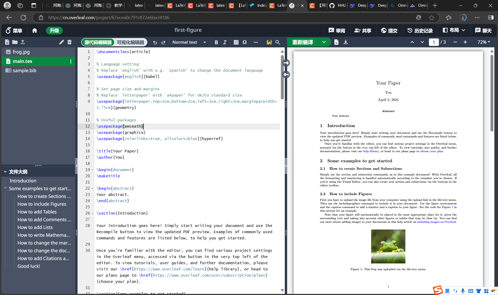
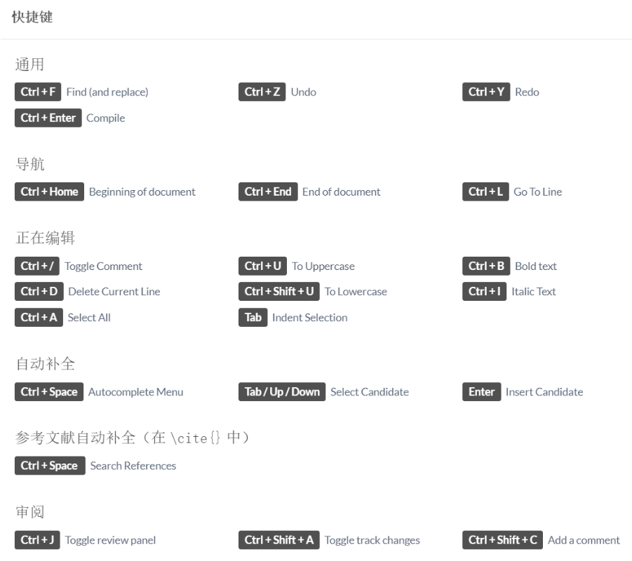
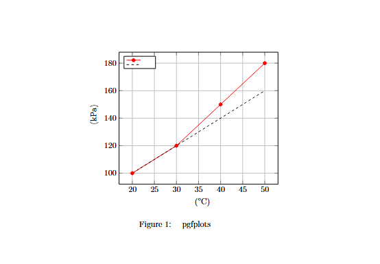

# Latex画图 
首先，共有在线和本地两种工具用来实现Latex画图，Overleaf支持中文界面，使用较为友好。

在线的工具为Overleaf，下面是网址，需要注册并登录：
https://www.overleaf.com/

同时，lates也可以完成学术论文的编写，可以采用样例模版进行开发和改写。

## 一些快捷键

## 统计图实例

1.折线图
这个软件可以直接生成图表的pdf版本。
